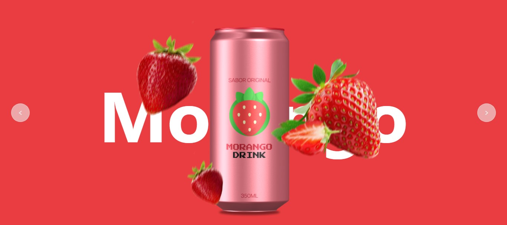
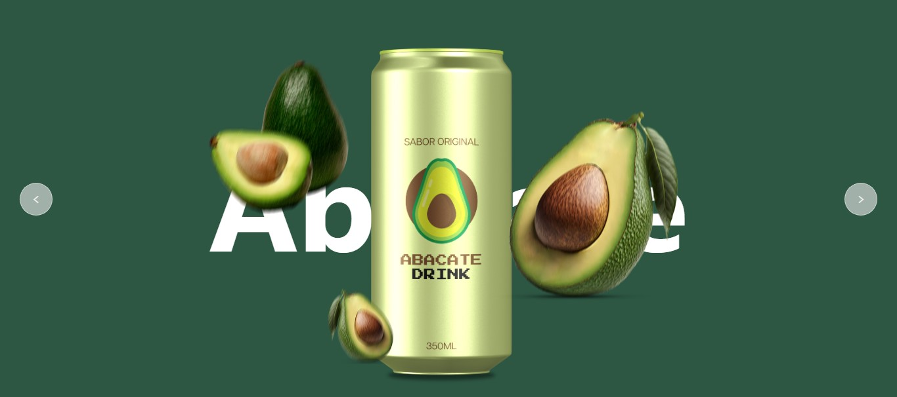
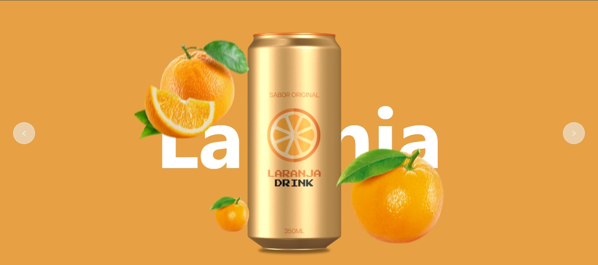

# 📌 Formulário para contato

Página de anúncio de um refrigerante com transição e animação.

---

## 🔗 Acesso ao projeto

[🔗 Clique aqui para acessar](https://luis-hans.github.io/refri_ads/)

---

## 🎯 Funcionalidades

- [x] Anunciar o produto.
- [x] Design elegante e chamantivo.

---

## 🖼️ Preview





---

## 🚀 Tecnologias utilizadas

- HTML
- CSS
- JAVASCRIPT

---

## ⚙️ Como usar

```bash
# Clone o repositório
git clone https://luis-hans.github.io/refri_ads

# Acesse a pasta do projeto
cd refri_ads

# Abra o arquivo index.html no navegador
```

---

## 📚 Aprendizados

- [x] Página para propaganda
- [x] Utilização de Tags semânticas do HTML
- [x] Utilização de animações com CSS
- [x] Mundanças nas classe HTML via JavaScript

---

## 🧾 Licença

Este projeto está sob a licença MIT. Sinta-se à vontade para usar, modificar e compartilhar!

---

## 🤝 Contato

Feito por Luís Henrique  
📬 luishenrique.lhans@gmail.com  
🐙 https://github.com/Luis-hans
